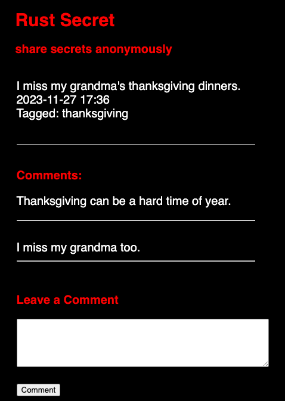

# Rust Secret by Nora Luna
based on [Post Secret](https://postsecret.com/)

An anonymous secret posting website where strangers can post their secrets to the discussion board and leave anonymous comments on individual secrets.

## How to Build and Run Rust Secret:

1. Download the files in this repository.
2. Ensure you have [Rust](https://www.rust-lang.org/tools/install) downloaded on your local machine.
3. Build the project: `cargo build`
4. Run the project: `cargo run`
5. Open a web browser. The project will run on Port 3000: `http://localhost:3000`

## How to Get Developer Docs:

1. If you have not already downloaded the files in the repo, do so.
2. Ensure you have [Rust](https://www.rust-lang.org/tools/install) downloaded on your local machine.
3. Run Rust Docs: `cargo doc --no-deps --open`
4. The docs will generate and open in your web browser.

## MVP: 
- A basic webpage that has the ability to post a secret to the main discussion board
- The ability to post a comment on a post
- A database to store the posted secrets and comments

## Stretch Goals (for the future):
- Subject Tags on posts ✅
- A search feature based on subject tags
- Links to popular subjects tags
- Option to post an image (more similar to postsecret)
- Input / upload validation
- Captcha 

## License

[LICENSE](LICENSE)

## Project Summary

Rust Secret is a blog-like website based on the anonymous secret project called Post Secret. Users can post anonymous secrets to the page and also leave anonymous comments on each individual secret. Its intended function is to create a space where we can release shame around the things we consider secrets and share in our humanity with one another. This project was written using Rust, and as a Rust learner I had plenty of challenges in creating this project. I am also fairly new to web app development, so the whole project was a massive learning experience and I'm happy with the final result. 

I used the [rusqlite](https://docs.rs/rusqlite/latest/rusqlite/) package which is a Rust wrapper for sqlite. This is my backend that holds all the secret information: the actual secret, timestamp, tag, and comments associated with each secret. This package was pretty simple to use for anyone with sqlite experience. One struggle I had in this area was how to organize comments in the database for each secret. I ended up using a JSON object in my database so that the comments would be associated with the correct secret in a single database table. This worked well for the project and I learned about the JSON functionality that sqlite offers. 

I used the [tera](https://docs.rs/tera/latest/tera/) template package for the html templates. This package is inspired by Jinja2, so has many similarities in terms of syntax. There were some minor differences, for example, the way URLs are embedded in form elements is different, so there was some nuance that was learned there. Overall, this package was a good option given my familiarity with Jinja2.

I used the [axum](https://docs.rs/axum/latest/axum/) package for my web application framework. I ended up choosing axum as my web framework because of its touted ergonoics and modularity. It ended up being an easier-to-use framework than some of the other options out there. There are definitely some unsightly lines of code in my opinion, for example this return value: `Result<Response<Body>, axum::body::Empty<axum::body::Bytes>>`. Debugging the code written with `axum` was made significantly easier with the [axum-macros](https://docs.rs/axum-macros/latest/axum_macros/) package which is specifically designed to offer more understandable debug messages. A challenge I encountered for this project was serving the CSS file. I am used to linking CSS in my HTML template, but with this project I had to serve the CSS file through its own `axum` route. 

With the time available for the project, I am pleased to have met my MVP goal. I have a list of different features I would love to add to continue my Rust learning listed under "Stretch Goals".

## Testing

All of the testing for this project was end-to-end testing done by locally hosting the page and entering secrets and comments by hand. One thing I would like to improve upon for this project would be getting unit testing and mocking frameworks set up so that I can properly test this software.

## Rust Secret UI

### Home Page

### Comment Page
